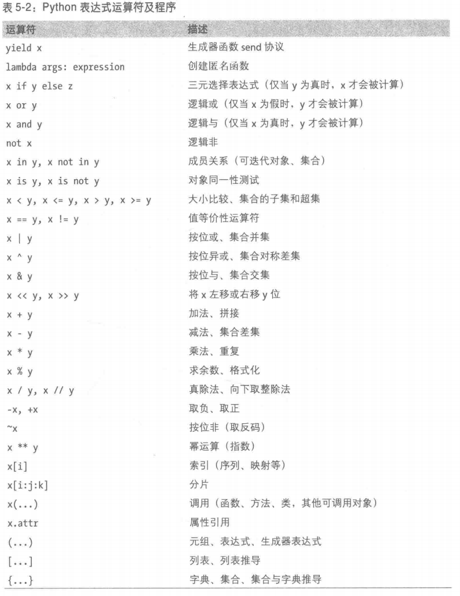
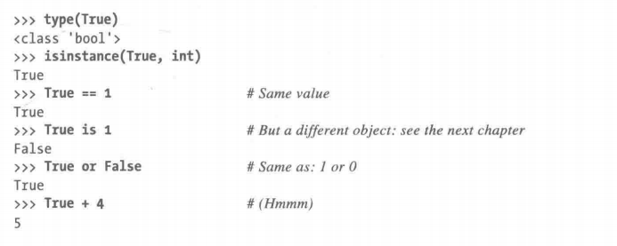

# Python 学习手册 上册

## 第一部分 使用入门

### 第一章、问答环节

#### python被人使用的原因

- 软件质量--可读性、一致性、可重用性、可维护性
- 开发者生产效率
  - 代码量少
  - 可立即运行，无需编译、链接
- 可移植性
- 标准库的支持
- 组件集成
- 乐趣

#### python 的缺点

- 执行速度慢 -- 调用c来解决，比如numpy

### 第二章、python 如何运行程序

python除了是个编程语言，但是它也是一个名为解释器的软件包。

解释器是代码与机器的计算机硬件之间的软件逻辑层。

#### python的运行结构

- 字节码编译

- python虚拟机 PVM
  - 迭代运行字节码指令的一个大循环

牢记python中真正拥有的只有运行时：完全不需要出事的编译阶段，所有的事情都是在程序运行时发生的。这甚至还包括建立函数和类的操作以及模块的链接。

### 第三章、你应当如何运行程序

#### 交互式命令行模式

可以使用譬如

```c++
python script.py > saveit.txt
```

todo

不知道为什么import this 会输出两遍

```python
import this
print("hello world")
print(2**100)
print(56)
for x in 'spam':
    print(x)
import this
///   
C:\Users\Administrator\Desktop>python this.py
hello world
1267650600228229401496703205376
56
s
p
a
m
hello world
1267650600228229401496703205376
56
s
p
a
m
///     
```


#### 系统命令行和文件

```python
import sys
print(sys.platform)
print(2**100)
x = 'spam!'
print(x*8)
----------------------------
win32
1267650600228229401496703205376
spam!spam!spam!spam!spam!spam!spam!spam!
```

#### UNIX 风格可执行脚本： #！

可执行脚本

- 第一行是特定的，脚本第一行往往以`#!`开头（hash bang , shebang）,其后紧跟着机器Python解释器的路径。
- 它们往往有可执行的权限。 在UNIX 上，往往可以使用`chmod + x file.py`来实现目的。

```python
#! /usr/local/bin/python
print('hello world')
```

可以使用env来定位python解释器。

3.3 版本后的python，可以通过#！来指定python运行版本


#### :star:模块导入和重载

在第五部分会深入学习模块和较大的程序架构

简单来说，每一个以拓展名.py结尾的python文件都是一个模块。导入操作从本质来说就是载入另一个文件，并给予读取那个文件内容的权限。

导入文件是另一种运行文件的方式。

可以用reload 重新载入模块，哪怕它已经被修改

> imp在3.4后面就不用了，，，这书还在教。。。
>
> 现在用importlib

每个模块都是一个变量包（命名空间），特别的是，每个模块都是自包含的命名空间，一个模块文件不能看到其他文件中定义的变量名。除非它显式地导入了那个文件。

作者建议使用from 而不是import，尽管可能会将命名覆盖，不过那也是编程者需要控制的。

reload不可传递

## 第二部分 类型和运算

### 第四章 介绍Python 对象类型

Python 脚本中的一切都是对象。

#### Python核心数据类型


一旦创建了一个对象，它就和操作集合绑定了。

<font color='#DB4437'>Python 是一种动态类型的语言，它自动跟踪你的类型而不是要求声明代码。但也是强类型语言，只能对一个对象进行适合该类型的有效操作。</font>

数字、字符串、元组是不可变的；列表、字典和集合不是如此

##### 数字

精度不是固定不变的。

##### 字符串

序列操作

字符串具有不可变性

```python
line = 'aaa,bbb,ccc,dd\n'
line
'aaa,bbb,ccc,dd\n'
line = line.rstrip()
line
'aaa,bbb,ccc,dd'
line.split(',')
['aaa', 'bbb', 'ccc', 'dd']
line
'aaa,bbb,ccc,dd'
```

Unicode 字符串

```python
'spam'
'spam'
'spam'.encode('utf8')
b'spam' #4bytes in UTF-8
'spam'.encode('utf16')
b'\xff\xfes\x00p\x00a\x00m\x00' #encoded to 10bytes in UTF-16
```

Python 3.X 在没有显式转型的情况下，将其普通字符串和字节串混合使用

#### 列表 []（最通用）

列表是一个任意类型的对象的位置先关的有序集合。

列表比起其他语言的数组要强大太多

* 没有固定类型的约束
* 没有固定大小
* 支持嵌套

不过列表也是有边界检查的，不允许使用不存在的元素，对列表末尾外赋值也是如此。

##### 推导

```python
M = [[1,2,3],[4,5,6],[7,8,9]]
M
[[1, 2, 3], [4, 5, 6], [7, 8, 9]]
M[1]
[4, 5, 6]
col1 = [row[1] for row in M]
col1
[2, 5, 8]
diag = [M[i][i] for i in [0,1,2]]
diag
[1, 5, 9]
```

#### 字典 {}

字典是映射。通过键值对来存储对象。

允许嵌套

最终释放只需要`res = 0` 即可

字典只支持通过键来访问对象

通过排序键，在使用时使字典有序,最新版本的可以一步完成

```python
M = {'a': 100,'f':44,'c':3}
M
{'a': 100, 'f': 44, 'c': 3}

KS = list(M.keys())
KS
['a', 'f', 'c']
ks.sort()
ks
['a', 'b', 'c']
for key in KS:
    print(key,'->',M[key])

    
a -> 100
c -> 3
f -> 44

for key in sorted(M):
    print(key,'->',M[key])

a -> 100
c -> 3
f -> 44
```


#### 迭代和优化

**可迭代对象**

- 内存中物理存储的序列
- 在迭代操作情况下每次产生一个元素的对象 -- 一种虚拟的序列

**迭代协议**

​	在响应next之前先用一个对象对iter内置函数作出相应，并在结束时触发一个异常。


#### 元组 () tuple

基本上就是一个不可变的列表 

```python
T = (1,3,4,5)
T
(1, 3, 4, 5)
T + (5,6)
(1, 3, 4, 5, 5, 6)
T
(1, 3, 4, 5)
```

虽然比起列表功能少，但是要的就是它的不可变。


#### 文件

文件对象是Python代码调用电脑上存放的外部文件的主要接口。

要创建一个文件对象，需调用内置的open函数以字符串的形式传递给它一个外部的文件名以及一个可选的表示处理模式的字符串。


### 第五章 数值类型

#### 数值字面量


#### 内置数值工具

- 表达式运算符

​		`+` `-` `*` `/` `>>` `&` 等

- 内置数学函数

  pow abs round int hex bin 等

- 工具模块

  random math等

- 一些专用于特定类型的方法

  浮点数变分数 - as_integer_ratio  		判断是否为整数 - is_integer

```python
import decimal
dVal = decimal.Decimal('-3.1415926')
print(dVal)
x = dVal.as_integer_ratio()
print(x)

-3.1415926
(-15707963, 5000000)
```


#### Python表达式运算符

运算符优先级从上到下逐渐增高




- 混合运算遵循运算符优先级

- 括号分组子表达式

- 混合类型向上转换   int变float这样

  另外这种混合类型转换仅适用于数值类型，一般来说，python不会再别的类型之间转换。


#### 数字的实际应用

##### 数值的显示格式

```python
#字符串格式化
num = 1/3
num
0.3333333333333333
'%e' % num
'3.333333e-01'
'%4.2f' %num
'0.33'
'{0:4.2f}'.format(num)
'0.33'
```


##### 除法

- `x / y`	经典除法和真除法，3.x后会变成真除法，无论何种类型，浮点数结果都会是保留小数部分。 
- `x // y `  向下取整除法，总是会省略结果的小数部分。
- 如果想用趋于0的截断，不管正负，就可以使用math.truec函数


##### 二、八、十六进制


```python
0o1,0o20,0o377
(1, 16, 255)
0x01,0x10,0xFF
(1, 16, 255)
0b1,0b10000,0b11111111
(1, 16, 255)
```

oct,hex,bin函数可以实现int向不同类型的转换

int函数可以实现对指定进制的转换

字符串格式化也可以用在这里

```python
'%o,%x,%x,%X' % (64, 64,255,255)
'100,40,ff,FF'
```


##### 随机


#### 其他数值类型

##### 小数类型

小数对象很像浮点数，但是它有固定的位数和小数点。

```python
0.1+0.1+0.1-0.3
#5.551115123125783e-17

#调用Decimal的构造函数，从一个表示小数的字符串传值
from decimal import Decimal
Decimal('0.1')+Decimal('0.1')+Decimal('0.1')-Decimal('0.3')
#Decimal('0.0')

#也可以通过浮点数直接创建小数对象，但是有时候会产生默认的小数位数
Decimal(0.1)+Decimal(0.1)+Decimal(0.1)-Decimal(0.3)
Decimal('2.775557561565156540423631668E-17')
```

**设置小数精度**

```python
import decimal
decimal.getcontext().prec =4
Decimal(0.1)+Decimal(0.1)+Decimal(0.1)-Decimal(0.3)
Decimal('1.110E-17')
```

Python 3.0 后，可以使用with上下文管理器语句来临时重置小数精度。

```python
import decimal
decimal.Decimal('1.00') / decimal.Decimal('3.00')
Decimal('0.3333') #这里是因为之前已经设置为4位精度了

with decimal.localcontext() as ctx:
    ctx.prec = 2
    decimal.Decimal('1.00') / decimal.Decimal('3.00')

    
Decimal('0.33')

decimal.Decimal('1.00') / decimal.Decimal('3.00')
Decimal('0.3333')
```


##### 分数类型

```python
from fractions import Fraction
x=Fraction(1,3)
x
Fraction(1, 3)
y = x +1
y
Fraction(4, 3)
print(y)
4/3
```


**从float创建Fraction**

```python
f = 2.5
from fractions import Fraction
z = Fraction(*f.as_integer_ratio())
z
Fraction(5, 2)
float(z)
2.5
```

*是一种特殊语法，可以把一个元组展开成单独的参数。

**限制小数位数**

```python
x = Fraction(1,3)
x
Fraction(1, 3)
a = x + Fraction(*(4.0/3).as_integer_ratio())
a
Fraction(22517998136852479, 13510798882111488)
a.limit_denominator(10)
Fraction(5, 3)
```


##### 集合

集合是一些唯一的、不可变的对象的无序集合体。很像一个有键无值的字典。

集合支持与或非异或等操作

```python
x = set('abcde')
y = set('bdxyz')
x
{'b', 'a', 'e', 'd', 'c'}
y
{'b', 'd', 'z', 'y', 'x'}
x-y #x去除b
{'a', 'e', 'c'}
x|y	#并集
{'b', 'a', 'e', 'd', 'c', 'z', 'y', 'x'}
x&y	#交集
{'d', 'b'}
x ^ y	#异或集
{'a', 'c', 'z', 'y', 'e', 'x'}
x>y , x<y #是否为子集
(False, False)
```

还支持一些in，add，update等操作。


###### 不可变性限制和冻结集合

集合只能包含不可变（可哈希化）的对象类型，因此，列表和字典不能嵌入到集合中。

集合本身是可变的，因此不能直接嵌入到其他集合里。

如果需要在另一个集合中存储一个集合，可以像调用set一样调用内置函数frozenset，创建一个不可变的集合，从而可以嵌套进其他集合里。

##### 布尔型

目前的python 有一个名为bool 的显式布尔数据类型，带有True 和False作为可用且预赋值的内置名称。

可以理解为True的值是1，但是不是数字类型。



### 第六章 动态类型

动态类型以及由它提供的多态性，无疑是Python语言简洁性和灵活性的基础。

在Python中，类型是在运行时自动决定的

变量在赋值时才被创建，它可以引用任何类型的对象，必须在引用前赋值。

变量和对象保存在内存的不同部分，通过引用相连接。


从技术上来讲，对象不仅仅有足够的空间表示它的值，还包含更复杂的结构。每一个对象都有两个标准的头部信息：类型标志符 `type designator` 标识这个对象的类型；引用的计数器`reference counter` 决定何时收回这个对象。

#### 类型属于对象而不是变量

Python 的变量就是在特定的时间引用了一个特定的对象。

而对象知道自己的类型，每个对象都包含一个头部消息，其中标记了这个对象的类型。（严格意义上来说，一个指向指定对象的指针）

#### 对象的垃圾收集

在Python中，每当一个变量名被赋予一个新的对象，如果原来的对象没有被其他的变量名或对象引用的话，那么之前的那个对象占用的空间就会被回收。

#### 共享引用

Python中变量总是一个指向对象的指针，而不是可改变的内存区域的标签。

在原位置修改（尤其是列表这些），指向同一个对象的变量会同步变化

如果不想要这种效果，可以申请Python去copy对象，而不是引用。

如果有嵌套结构，也想同步复制，那么可以使用deep_copy。

相等的判断

- `==` 运算符，测试两个被引用的对象是否有相同的值
- `is`运算符，检查对象的同一性。实际上是比较实现引用的指针。


#### “弱引用”

通过weakref标准库来实现的一种防止对象被垃圾回收的引用。如果对象的最后一次引用是弱引用，那么这个对象将被重新声明，而相应的弱引用会被自动删除（或被告知）。

对于基于字典的大对象缓存来说十分有用。


### 第七章 字符串基础

Python字符串 ---  一个有序的字符集合

【37章】会讲unicode字符串，本章只讲基本的字符串

严格的说，Python的字符串被划分为不可变序列这一类别（从左到右的顺序，且不可在原位置修改）


#### 字符串字面量


单引号和双引号是一样的，建议使用单引号。

字符串之间加`,` 会创建一个元组。除非字符串内嵌了单引号，否则字符串会以单引号打印这些字符串。

想用单引号内嵌单引号，得用转义符。

```python
E = 'anb'a'
SyntaxError: unterminated string literal (detected at line 1)
E = 'ans"a'
E
'ans"a'
E = 'ad\'fa'
E
"ad'fa"
```

> 常用转义符
>
> 

##### 原始字符串阻止转义

用r或者双斜杠

```python
myfile = open(r'C:\new\text.dat','w')
myfile = open('C:\\new\\text.dat','w')
```

注：尽管可以阻止转义，但是即使一个原始字符串也不能以一个单个反斜杠结尾，因为反斜杠会转义后面的引号。

##### 三引号编写多行块字符串

转折处内嵌`\n`


可以使用三引号来注释打断代码。虽然会创建字符串，不过也没什么损耗。


#### 实际应用中的字符串

##### 基本操作

- 使用`+`拼接字符串
- 使用*重复它们

##### 索引和分片


k可以是负数，那么就实现反转。

```python
C
'C:\\new\\text.dat'
C[::-1]
'tad.txet\\wen\\:C'
```

##### 字符串转换

###### 字符串转换工具

Python座右铭之一	--	拒绝猜测。

所以字符串（哪怕是数字字符串）也不能与数字相加。

可以使用`str()` 、`int()`这些转换函数实现互相转换。

###### 字符串代码转换

可以将单个字符转换为其底层的整数码（ASCII字节值）

```python
ord('s')
115
chr(115)
's'
```

##### 修改字符串①

不能在原位置修改一个字符串，比如给索引赋值。

要想改变一个字符串，通常需要利用拼接、分片这些工具。

##### 字符串格式化表达式


#### 字符串方法


> # 方法调用语法
>
> 

Python 3.3里的字符串方法


##### 示例1 修改字符串②

- `replace` 

两个参数分别为最初子串和替换最初子串的字符串，后全局搜索进行替换

```python
'aa$bb$cc$dd'.replace('$','##')
'aa##bb##cc##dd'
```

​	replace 返回一个新的字符串，因为字符串不可变，本质上是替换了原字符串。

> ## list&join 方法
>
> 先转为列表打散后拼接
>
> 

##### 示例2 解析文本

文本解析 --  分析结构并提取子串

- `split` 

  将一个字符串从分隔符处切成一系列子串。默认为空格。

- `rstrip()`

  清除每行末尾的空白


#### 字符串格式化表达式

##### 格式字符串基础

  

  

  

  

#####   基于字典的格式化表达式

  ```python
  '%(qty)d more %(food)s' % {'qty':1,'food':'spam'}
  '1 more spam'
  ------------------------------------------------------
  reply = '''
  Greetings...
  Hello %(name)s !
  Your age is %(age)s
  '''
  values = {'name' :'Bob', 'age' : 48}
  print(reply %values)
  Greetings...
  Hello Bob !
  Your age is 48
  ```


####   字符串格式化方法调用

##### 字符串格式化方法基础

 Python2.6 开始，新增了一种格式化字符串的函数 **str.format()**，它增强了字符串格式化的功能。

基本语法是通过 **{}** 和 **:** 来代替以前的 **%** 。

format 函数可以接受不限个参数，位置可以不按顺序。

实例

```python
"{} {}".format("hello", "world")    # 不设置指定位置，按默认顺序 
'hello world'

"{0} {1}".format("hello", "world")  # 设置指定位置 
'hello world'

"{1} {0} {1}".format("hello", "world")  # 设置指定位置 
'world hello world'
```


也可以设置参数：

**实例**

```python
#!/usr/bin/python 
# -*- coding: UTF-8 -*-  
print("网站名：{name}, 地址 {url}".format(name="菜鸟教程", url="www.runoob.com"))  

# 通过字典设置参数 
site = {"name": "菜鸟教程", "url": "www.runoob.com"} 
print("网站名：{name}, 地址 {url}".format(**site))  

# 通过列表索引设置参数 
my_list = ['菜鸟教程', 'www.runoob.com'] 
print("网站名：{0[0]}, 地址 {0[1]}".format(my_list))  # "0" 是必须的
```


输出结果为：

```
网站名：菜鸟教程, 地址 www.runoob.com
网站名：菜鸟教程, 地址 www.runoob.com
网站名：菜鸟教程, 地址 www.runoob.com
```

也可以向 **str.format()** 传入对象：

**实例**

```python
#!/usr/bin/python 
# -*- coding: UTF-8 -*-  
class AssignValue(object):    
    def __init__(self, value):        
        self.value = value my_value = AssignValue(6) 
print('value 为: {0.value}'.format(my_value))  # "0" 是可选的
```

输出结果为：

```
value 为: 6
```

**数字格式化**

下表展示了 str.format() 格式化数字的多种方法：

```
>>> print("{:.2f}".format(3.1415926))
3.14
```

  

#####  高级格式化方法语法

可以通过在标识码后面加冒号指定字段大小、对齐方式和特定类型编码的格式化说明符

四个部分都是可选的，中间不得有空格

```python
{fieldname component !conversionflag :formatspec}
```

- fieldname 是辨识参数的一个可选的数字或关键字，在目前版本可以将其省略以使用相对参数编号
- component 是有着大于零个".name" 或"[index]"引用的字符串，它可以被省略以使用完整的参数值，其中的引用用来获取参数的属性或索引值。
- conversionflag 如果出现则以！开始，后面跟着r、s或a，在这个值上分别调用repr、str、ascii内置函数。
- formatspec如果出现则以：开始，后面跟着文本，指定了如果表示该值，包括字段宽度、对齐方式、补零、小数精度等细节，并且以一个可选的数据类型码结束。


```python
import sys
'{.platform:>10} = {[kind]:<10}'.format(sys,dict(kind = 'laptop'))
'     win32 = laptop    '


'{0:b}'.format((2**16)-1)
'1111111111111111'
'{0:o}'.format((2**16)-1)
'177777'

'{:,d}'.format(9999999999999)
'9,999,999,999,999'
```


> ## [f-Strings](https://www.zhihu.com/search?q=f-Strings&search_source=Entity&hybrid_search_source=Entity&hybrid_search_extra={"sourceType"%3A"article"%2C"sourceId"%3A"90439125"})：一种改进版格式化方式
>
> 
>
> Python 3.6 引入了新的字符串格式化方式，这种方式来自于 Eric V. Smith 在 2015 年 8 月提出的方案，具体可以参考[PEP 498](https://link.zhihu.com/?target=https%3A//www.python.org/dev/peps/pep-0498/)。
>
> f-strings 也称作“格式化的[字符串字面量](https://www.zhihu.com/search?q=字符串字面量&search_source=Entity&hybrid_search_source=Entity&hybrid_search_extra={"sourceType"%3A"article"%2C"sourceId"%3A"90439125"})”，它是一个带有 `f` 前缀的字符串，通过大括号嵌入所需的 Python 表达式，这些表达式的具体值是在运行时确定的，背后依赖的也是嵌入对象的 `__format()__` 接口。查看 [官方文档](https://link.zhihu.com/?target=https%3A//docs.python.org/3/reference/lexical_analysis.html%23f-strings) 可以获得更多信息。
>
> 以下是一些具体使用方式：
>
> ### 最简单的句法
>
> f-strings 的句法类似于`str.format()`，但要更简洁，你可以感受一下它的可读性：
>
> ```text
> >>> name = "Eric"
> >>> age = 74
> >>> f"Hello, {name}. You are {age}."
> 'Hello, Eric. You are 74.'
> ```
>
> 前缀`f`也可以使用大写的`F`。
>
> ```text
> >>> F"Hello, {name}. You are {age}."
> 'Hello, Eric. You are 74.'
> ```
>
> 你是不是已经开始喜欢上这种格式化方式了？
>
> ### 支持任意表达式
>
> 由于 f-strings 是在运行时计算具体值的，我们得以在字符串中嵌入任意有效的 Python 表达式，从而写出更优雅的代码。
>
> 你可以使用很直接的计算式，比如说：
>
> ```text
> >>> f"{2 * 37}"
> '74'
> ```
>
> 也可以在里面调用函数：
>
> ```text
> >>> def to_lowercase(input):
> ...     return input.lower() 
> >>> name = "Eric Idle"
> >>> f"{to_lowercase(name)} is funny."
> 'eric idle is funny.'
> ```
>
> 或者直接调用对象的方法：
>
> ```text
> >>> f"{name.lower()} is funny."
> 'eric idle is funny.'
> ```
>
> 甚至可以在对象的字符串方法中直接使用 f-strings，例如有以下类：
>
> ```text
> class Comedian:
>     def __init__(self, first_name, last_name, age):
>         self.first_name = first_name
>         self.last_name = last_name
>         self.age = age
> 
>      def __str__(self):
>         return f"{self.first_name} {self.last_name} is {self.age}."
> 
>      def __repr__(self):
>         return f"{self.first_name} {self.last_name} is {self.age}. Surprise!"
> ```
>
> 你可以有如下代码：
>
> ```text
> >>> new_comedian = Comedian("Eric", "Idle", "74")
> >>> f"{new_comedian}"
> 'Eric Idle is 74.'
> ```
>
> `__str__()`方法与`__repr__()`方法用于处理对象的字符串显示方式，我们有必要至少定义其中一个。如果必须二选一的话，建议使用`__repr__()`，在`__str__()`方法没有定义的情况下，解释器会自动调用`__repr__()`方法。
>
> `__str__()`方法返回的是对象的非正式字符串表示，主要考虑可读性，而`__repr__()`方法返回的是对象的正式字符串表示，主要考虑精确性。调用这两个函数时，比较推荐的方式是直接使用内置函数`str()`和`repr()`。
>
> f-strings 会默认调用对象的`__str__()`方法，如果要强制使用`__repr__()`方法，则可以在变量之后加上转换标志`!r`：
>
> ```text
> >>> f"{new_comedian}"'Eric Idle is 74.'
> >>> f"{new_comedian!r}"
> 'Eric Idle is 74. Surprise!'
> ```
>
> 想要了解更多 f-strings 的转换问题，可以阅读 [相关资料](https://link.zhihu.com/?target=https%3A//mail.python.org/pipermail/python-ideas/2015-July/034726.html)。


### 第八章 列表与字典

#### 列表

##### 列表的主要属性

- 任意对象的有序集合
- 通过偏移进行索引进行访问，可以进行分片、拼接的操作
- 可变长度、异构以及任意嵌套
- 属于可变序列的分类，可在原位置被修改。
- 对象引用数组

##### 常用列表字面量和操作


###### 分片赋值

```python
L = ['Spam','123','ABS']
L
['Spam', '123', 'ABS']
L[0:2] = ['Python','easy']
L
['Python', 'easy', 'ABS']
```

这里可以分两步来理解，

- 删除：首先是删除等号左边指定的切片
- 插入：将包含杂等号右边可迭代对象中的片段插入旧分片被删除的位置。

这种方式可以用在头尾部拼接上

```python
L[:0] = [3,4,5]
L
[3, 4, 5, 'Python', 'easy', 'ABS']
L[len(L):] = [55,6,77] # 类似于L.extend([55,6,77])
L
[3, 4, 5, 'Python', 'easy', 'ABS', 55, 6, 77]
```


###### append 和 extend 的区别

- extend 总是循环访问传入的可迭代对象，并逐个把产生的元素添加到列表尾部。
- append 会直接把这个传入的可迭代对象添加到尾部而不会遍历它

第14章会详细分析里面的差异，

> append()和extend()都可以在在原有列表上增加对象，但是使用起来有很大区别。
>
> append()用于在列表末尾添加新的对象，任意对象都是可以的，列表只占一个索引位，会修改原来的列表。
>
> extend()向列表尾部追加一个列表，对象必须是一个可以迭代的序列

通过append 和 pop，可以实现类似栈的LIFO结构。列表的末端作为栈的顶端。

#### 字典

##### 字典的主要属性如下

- 通过键而不是偏移量来读取

  字典又被叫做关联数组或者散列表hash

- 任意对象的无序集合

- 长度可变、异构、任意嵌套

- 属于可变映射类型

- 对象引用表（散列表）


##### 常见字典字面量和操作


如表8-2所示，字典通过键进行索引，嵌套的字典项是有一系列索引（方括号中的键）来访问的。

##### 字典用法注意事项

- 序列运算无效
- 对新索引赋值会添加项
- 键不一定总是字符串


例子：对稀疏数据结构使用字典：用元组做键

```python
Matrix = {}
Matrix[(2,3,4)] = 88
Matrix[(5,4,2)] = 99
Matrix
#{(2, 3, 4): 88, (5, 4, 2): 99}
```


##### 避免键不存在错误

读取不存在的键在稀疏矩阵来说很常见。

这里有至少三种方法来填入默认值而不会出现这样的错误提示

```python
if(2,3,4) in Matrix:
    print(Matrix[(2,3,4)])
else:
    print(0)
    
try:
    print(Matrix[(2,3,4)])
except KeyError:
    print(0)
    
Matrix.get((2,3,4),0)
```

编码角度来说，get更简洁，但是if和try更普遍【第十章会讲】


##### 字典的嵌套

要访问嵌套的数据，简单的索引操作穿起来就行了。


#### 创建字典的其他方式

```python
{'name':'bob','age':40}

D = {}
D['name'] = 'Bob'
D['age'] = 40

dict(name = 'Bob',age = 40)

dict([('name','bob'),('age',40)])
```

- 如果你可以实现拼出整个字典，那么第一种是很方便
- 如果你需要一次动态地建立字典的一个字段，第二种比较合适
- 第三种关键字形式所需的代码比字面量少，但是键必须都是字符串才行
- 如果你需要在程序运行时通过序列构建字典，那么最后一种形式比较有用。


### 第九章 元组、文件与其他核心类型

元组（一种无法修改的其他对象的集合）以及文件（一种计算机上外部文件的接口）


#### 元组

##### 元组的主要属性

* 任意对象的有序集合
* 通过偏移量存取
* 属于不可变序列
* 固定长度、多样性、任意嵌套
* 对象引用的数组

##### 常见的元组字面量和运算


##### 元组的实际应用

```python
y = (50,)
```

元组的特殊语法：逗号和圆括号

如果不是`，`，那么y就是一个简单的整数。


有了列表还要元组，是因为保持某种一致性，即元组在程序中不会被另一个引用修改。

#### 文件

##### 常见的文件操作


##### 使用文件

一旦你有open函数产生了一个文件对象，就可以调用它的方法来读取或写入对应的外部文件。在任何情况下，文件的文本在Python程序中都采用字符串的形式。读取文件时会返回字符串形式的文本。写入文件的文本作为字符串被传入write方法。

如下是一些基础用法的提示：

- 文件迭代器最适合逐行读取

- 内容是字符串，不是对象

- 文件是被缓冲的，以及可定位的

- close 通常是可选的：回收时自动关闭

  手动关闭是个好习惯


##### 存储Python原生对象：pickle

pickle模块可以让我们直接在文件中存储几乎任何Python对象的高级工具同时不需要我们对字符串进行来回转换。

##### 用JSON格式存储Python对象

可移植性比较好。


##### 其他的文件工具

- 标准流

  在sys模块预先打开的文件对象

- os模块中的描述文件

  文件的整数参数，能够支持如文件锁定之类的较低级工具

- 套接字、管道和FIFO文件

  用于同步进程或者通过网络进行通信的类文件对象

- 通过键来存取的文件

  通过键直接存储经过pickle模块序列化的不可变的Python对象

- Shell命令流

  类似os.popen 这样的工具，支持shell命令处理，并读取和写入到标准流


### 核心类型复习与总结


#### 对象灵活性


#### 比较、等价和真值


- `==` 运算符测试值的等价性	     --Python会运行等价性测试，并递归地比较所有内嵌对象。
- `is` 表达式测试对象的同一性     --Python测试在存储器中的相同地址


#### Python的类型层次


## 第三部分 语句和语法

### 第十章 Python 语句简介

#### Python 的结构

1. 程序由模块构成
2. 模块包含语句
3. 语句包含表达式
4. 表达式创建并处理对象


#### Python语句


